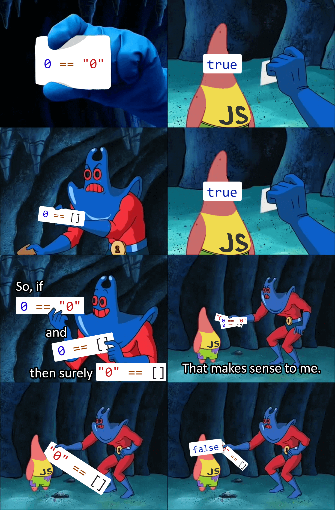

inspired by 海绵宝宝meme（

<!-- more -->

## 起因

如图所示（其实是因为不熟悉，导致平时用起来有点抗拒



好啦，meme归meme，那么JS这令人诟病的值比较究竟是怎么样的呢？

## Type of value

在JS里头，value有两种：primitive和object

primitive分别是 `string`, `number`, `bigint`, `boolean`, `undefined`, `symbol`, `null`

其特点就是immutable，即它们的值不能被更改。不像数组，对象，函数那样，可以把自身的property给更改。如果一个被赋值了primitive的变量的value被更改，那就是这个变量被赋了个新值。

至于object类型，Objects are held by reference。这跟Java是差不多的。

```javascript
let a = { x: 114514 };
let b = a; // copy the reference and assign to b
b.x = 1919810;
console.log(a.x); // 1919810

let c = 114514;
let d = c; // assigning a new primitive, but not copying the reference
d = 1919810;
console.log(c); // 114514
```

`undefined`指的是一个变量的值为空（没有赋值），这跟`null`不一样

`Symbol`是一个有特殊用途的primitive，平时表现为一个隐藏的值。通常作为一个对象的特殊key。

`function`和`array`是特殊的Object类型

`typeof`这里也有一点坑，理论上primitive就显示对应的类型，但是`null`却不是如此

```javascript
typeof function() {} // "function"
typeof [1919, 810] // "object" but not "array"
typeof null // "object" but not "null"
```

## Falsy values

这里插入falsy value，为后面比较做铺垫

下面这些值都是false

- `false`
- `null`
- `undefined`
- `NaN`
- `0` (zero)
- `-0` (Number negative zero)
- `0n` (BigInt zero)
- empty string ("" or '' or ``)

## Operator || &&

与此同时，顺便插入跟其他常见语言行为有点不同的`&&`和`||`运算符运算规则

meaning|statement|
--|--|
Logic OR| If expr1 can be converted to true, returns expr1; else, returns expr2.|
Logic AND| If expr1 can be converted to true, returns expr2; else, returns expr1.|

```javascript
let a = undefined || 114514; // a = 114514
let b = undefined && 1919810; // b = undefined
let c = "you" || "me"; // c = you
let d = "you" && "me"; // d = me
```

根据**短路运算**的规则来理解就行了，比如Logic OR，第一个true就扔回第一个，否则就会比较第二个，因此第一个false就会扔回第二个。Logic AND也是如此

并且因为js用来判断false和true的是用falsy value和truthy value，所以使用if语句的时候，要注意哪些东西在js里头是falsy的。

## ==

`==`与`===`这两个在同类型比较的时候，行为是**一样**的。

但是在两个待比较的值的类型不同的时候，就会产生差别，`==`会把类型做转换后再进行比较值（强制比较，即Coercive equality）。（注意：这区别于value的单独出现，比如`[]`是truthy value，但是在做`==`比较的时候就会强制转换类型）

且优先做**primitive numeric comparison**，即

1. 把`object`(如果不是`primitive`)类型的值转到`primitive`(使用`valueOf()`或者`toString()`，优先前者，没有的话才会考虑调用后者)
2. 再转为`number`(如果此时的`primitive`还不是数字)进行比较

```javascript
114514 == "114514" // true, (string -> number)
0 == true // false (boolean -> number)
```

对于数组的话，用`==`作比较的时候，会发生类型转换，使用了`toString()`或`valueOf()`

```javascript
[].toString(); // ""
[] == "" // true
[] == "0" // true
[] == 0 // true
[] == false // true

[114514].toString() // "114514"
[114514] == "114514" // true
[114514] == 114514 // true
```

所以海绵宝宝meme里头的`"0" == 0`, `0 == []`都是`true`。`[].toString()`得到`""`，所以`"0" == []`是`false`而`'' == []`为`true`

对于`null`和`undefined`，spec里面也说了

> The Undefined type has exactly one value, called undefined. Any variable that has not been assigned a value has the value undefined.(8.1)
> The Null type has exactly one value, called null.(8.2)
> If x is null and y is undefined, return true.(11.9.3)
> If x is undefined and y is null, return true.(11.9.3)

因此

```javascript
null == null // true
undefined == undefined // true
null == undefined // true
undefined == null // true
```

并且`null` `undefined`在与其他值进行比较的时候，都不能进行强制类型转化

```javascript
5 == null // false
14 == undefined // false
```

特殊的`NaN`则是：**只要**有一边的操作数为NaN那么进行恒等于比较就会是false，不等于的比较则是true

### 小总结

如果两边都是primitive，那么优先强制转化为number比较

如果两边都是对象的引用，则看这两个引用是不是指向同一个对象

而对于一边是对象而另一边是string或number的情况，那么对象就是转化为`primitive`

**优先**使用的是`Symbol.toPrimitive`。没有的话，就还是`toString()`和`valueOf()`,hint为`string`就是优先`toString()`再`valueOf()`，hint为其他就是反之。

```javascript
const obj = {
    [Symbol.toPrimitive](hint) {
        if (hint === "default") { // default, number or string
            return "114514";
        }
    }
};

console.log(obj == 114514); // true
```

## > < >= <=

那`<`和`>`和`>=`和`<=`呢？其比较的原理跟`==`的一样(没有`<==`这种东西)，所以`==`的规则还是要懂的

还要注意字符串的比较，是一个一个字符的进行比较(像Java里头String的`compareTo()`

```javascript
let x = "10";
let y = "9";

x < y // false
```

## ===

`===`是比较严格的比较。**先**比较类型，类型相同，再比较值。

但也不是真正的strict equal comparison

```javascript
NaN === NaN // false
0 === -0 // true
+0 === -0 // true
```

## Object.is

刚刚`===`出现的这些个问题都可以用`Object.is()`来解决，所以`Object.is()`就是`====`了（手滑

一个polyfill如下（摘自MDN）

```javascript
if (!Object.is) {
  Object.defineProperty(Object, "is", {
    value: function (x, y) {
      // SameValue algorithm
      if (x === y) {
        // return true if x and y are not 0, OR
        // if x and y are both 0 of the same sign.
        // This checks for cases 1 and 2 above.
        return x !== 0 || 1 / x === 1 / y;
      } else {
        // return true if both x AND y evaluate to NaN.
        // The only possibility for a variable to not be strictly equal to itself
        // is when that variable evaluates to NaN (example: Number.NaN, 0/0, NaN).
        // This checks for case 3.
        return x !== x && y !== y;
      }
    }
  });
}
```

## 最后

知道了一些规矩，感觉也不像之前那么玄学了

虽然被说是糟粕，但是比较大于小于的时候必须要用啊...

所以，玄学来源于未知（强行解释）
