gzhu大一下程序设计课程设计

<!-- more -->

## 写在前面

本来想考试周一过就开始总结大一下的期末课设，结果...草，甚至过了快一个月了，才开始动工。

既然都做了，那就粗略地总结一下，顺便供学弟学妹们参考使用（狗头）

以下记录为两者的掺杂——一个月前的实验报告和现在所写的部分段落。

该课设的仓库：[https://github.com/situ2001/course-design-oo](https://github.com/situ2001/course-design-oo)

## 内容

此次课设要从下面五个中选一个来做，其实...都很大众的，分别是学生成绩管理系统，几何图形画板，学籍管理系统，高校人员信息管理系统和停车场管理（想了解的话，该课设文件已上传该课设github仓库下）

并且...从要求中的某张图可以看到是个~~**祖传了13年**~~的课设（隔壁网安专业就就没这种历史包裹

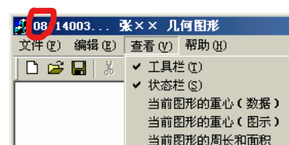

最后我选择了最后一个也就是停车场管理系统。题目如下所示。

编写停车场收费管理系统，定义汽车类`Car`和管理员类`CarManager`。

`Car`类有`number`(车牌号),`model`(车型)、`enterTime`(入场时间)、 `quitTime`(出场时间)、`price`(每小时收费价)、cost(费用)等属性。

`CarManager`类有`id`和`key`等。

实现以下收费功能：

1. 可用车位统计与查询
2. 零车位提示
3. 停车时长统计
4. 按车型时长收费
5. 管理员收费累计

## 思路

首先这是一个停车场的收费管理系统，注意 Keywords：**停车场**，**收费**，**管理**

然后先看看设计，我必须要定义`Car`和`CarManager`，根据列出来的属性，我可以推测，实体`Car`就是用来表达一辆车的状态和自身属性的，而`CarManager`的两个属性，我可以推测出，这应该是用来登录的。

接着再自己思考一下应该怎么做。

1. 先确定好这些类所对应的数据和行为
2. 想出该软件的大致功能与逻辑
3. 粗略画出界面的样子
4. 如何与用户交互
5. 着手开始实现

由于这个需要一个可视化的窗口程序，再加上最近学会了 JavaScript 想要做个项目练练手，正巧碰上了这次的课设。

## 纸上谈兵

首先这得是一个桌面GUI程序对吧。既然如此，那么

这个程序的界面应该要给用户展示实时的车位信息，让用户进行车辆的停放与离场操作

并且可以让管理员进行登录，管理页面可以看到停的每辆车的详细信息，以及总收入

该程序的信息和设置都保存到本地文件中，并在启动应用时进行配置文件检查与信息读取与载入

## 开始实现

用到的大致的工具有：JavaScript + TypeScript + Electron + React + antd + Webpack + Babel + crypto-js + electron-store，而版本控制则用了git（~~最后在删module的时候不小心删了.git文件夹~~）。

### Electron 部分

我们可以利用HTML+CSS+JavaScript三件套来构建一个Electron应用。

先去查查electron的文档。从 Electron 官网可以得知，应用分为两个进程：main 与 renderer，不同进程的JS Runtime环境略有不同，entry file也不同。其中，main为主进程，负责与系统 api 的通讯，renderer主要为渲染进程，主要负责页面的加载。

由于 main 进程主要负责与系统 api 的通讯。因此在该程序中，main 进程则负责配置文件的检查、配置文件读取与写入的 ipc 的建立、以及打开配置文件所在的文件夹的功能。而对于 renderer 部分来说，就是窗口的主体部分了。

### Class 部分

照着题目所提的要求，构建两个类就行了。很简单的过程

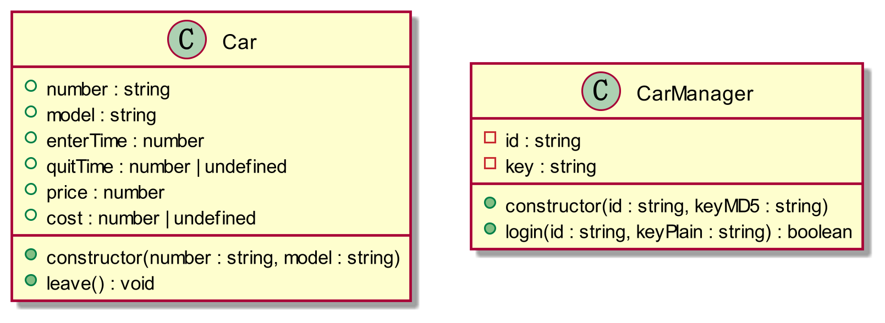

### Controller 部分

该部分的模块， 存了实例化了的对象，以及操作这些对象的方法。

比如，其中的停车记录模块的初始化流程大致如下图

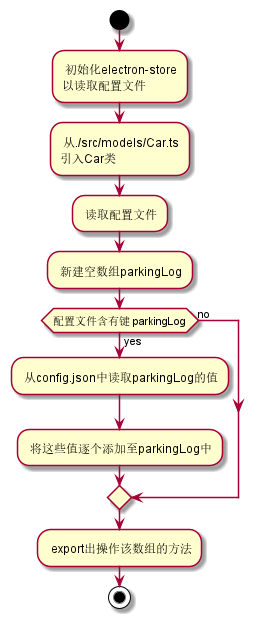

除此之外还对登录状态进行了保存（`localStorage`），管理员的密码都用了MD5加密。

（对于这类模块，我的做法是把它们归到了controllers部分，我的想法是：这些模块可以对实体对象的数据进行修改，还可以导致UI部分的更新。如果有错请指出）

### React 部分

UI库就是用React了，由于该课程设计为面向对象程序设计，~~所以就没有采用 React Hooks~~而是用了 class component

大致流程是：在创建界面前，调用 controllers 的方法，得到当前数据，改变组件的`state`， 更新状态并渲染出界面。

React组件之间的关系如下，继承+组合

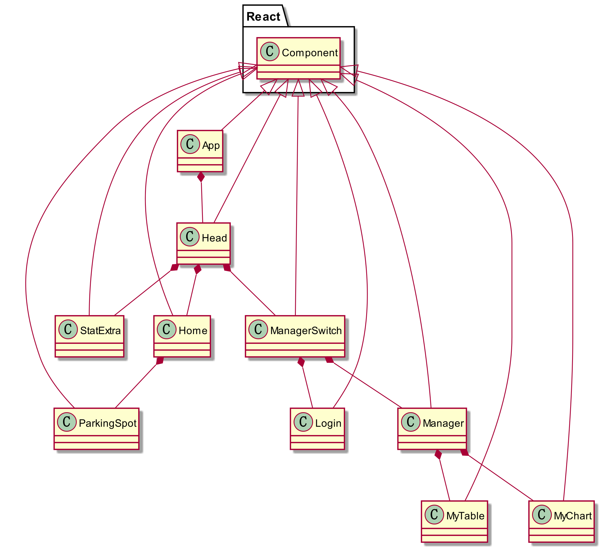

React的大致生命周期如下图所示

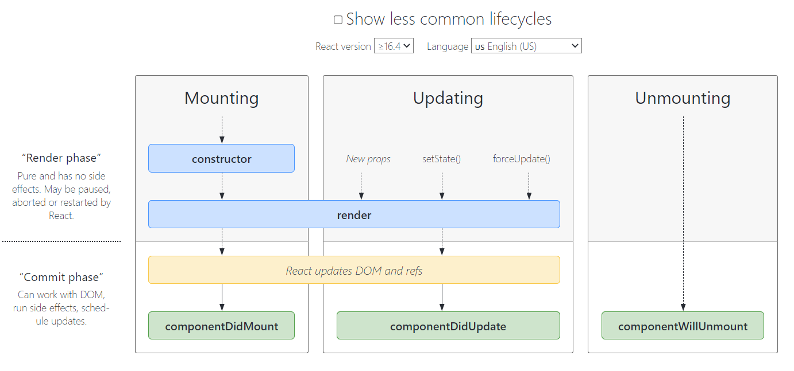

## 问题记录

这个方面嘛，当时做的不是很好，没有边做边用做记录，导致现在都忘记了一些当时让人感到酸爽的问题了。。。只记得一小撮问题了。

### 车牌检查

用户乱输入车牌诶，如果解决？答曰：使用正则表达式

关于车牌的限制，我是去网上找了一些规则，然后写出了下面这个正则表达式

```jsx
/^[A-Za-z]{1}[A-Za-z0-9]{4}[A-Za-z0-9挂学警港澳]{1}$/g
```

解释如下，先匹配string的开始，然后第一字符是大小写字母，第2到第5个字符是数字或者是大小写字母，第六个就是数字字母外加挂学警港澳这几个汉子，最后匹配string的结束。

对此，举个例子：`A14514`是合法的而`DSSQ恶臭`是不合法的。

### 保留登录状态

~~由于管理页和登录页的React组件是根据是否登录来选择性渲染的~~，所以总不能不记录登录状态吧。

思考了一下，这个课设又没有做backend，~~二是没有投入生产中去~~

所以的话，就使用了localStorage了，去搜索了一下，发现在浏览器端保存信息，可以用下面几个Web Storage API ：`Window.localStorage` 和 `Window.sessionStorage` 。当然还可以用Cookie和IndexedDB来进行信息的保存。（**日后开坑**x1）

### 打包

就记录一下我碰到一些的工具吧——Webpack和Babel

由于这个课设我用了脚手架electron-react-boilerplate来进行快速搭建，所以直接碰到了~~配置好了的~~ Webpack和Babel，既然都写好了那我就看看能不能通过阅读配置文件和官方文档来学习一下吧（**日后开坑**x2）

### 流程图

最后还遇到了一个有趣的工具——PlantUML，可以用来画流程图UML图等（上面的图都是用这个工具来画的），有意思的是，思维导图也被支持了（目前仍在测试中）

## 成品截图

### User-side

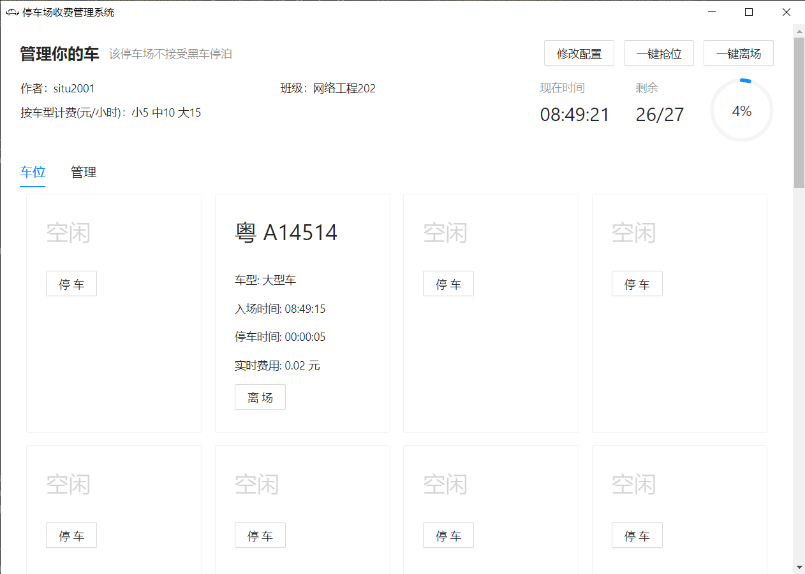

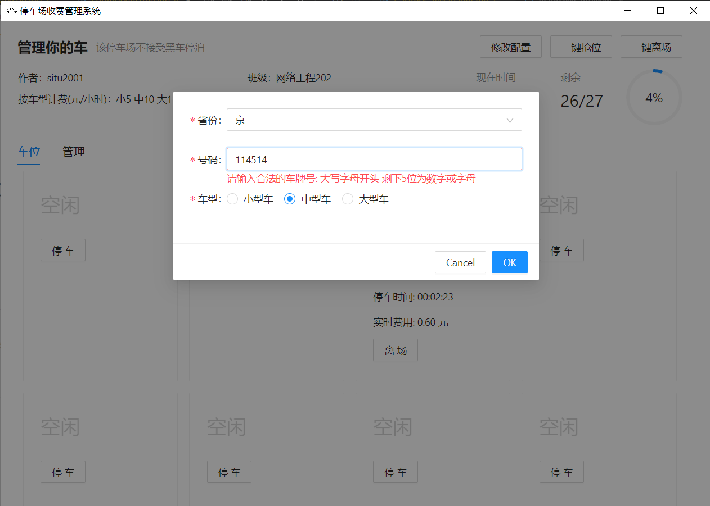

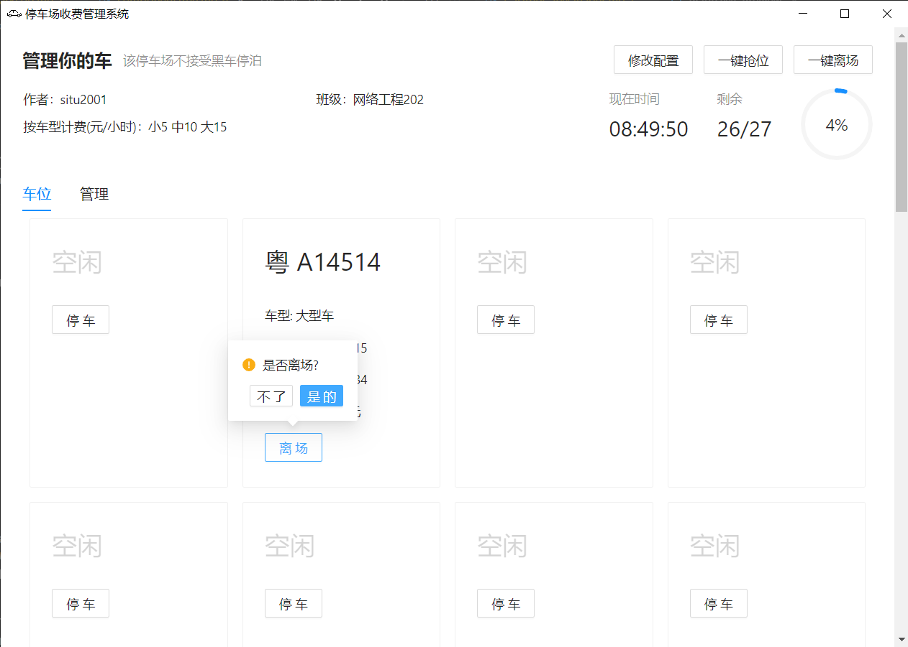

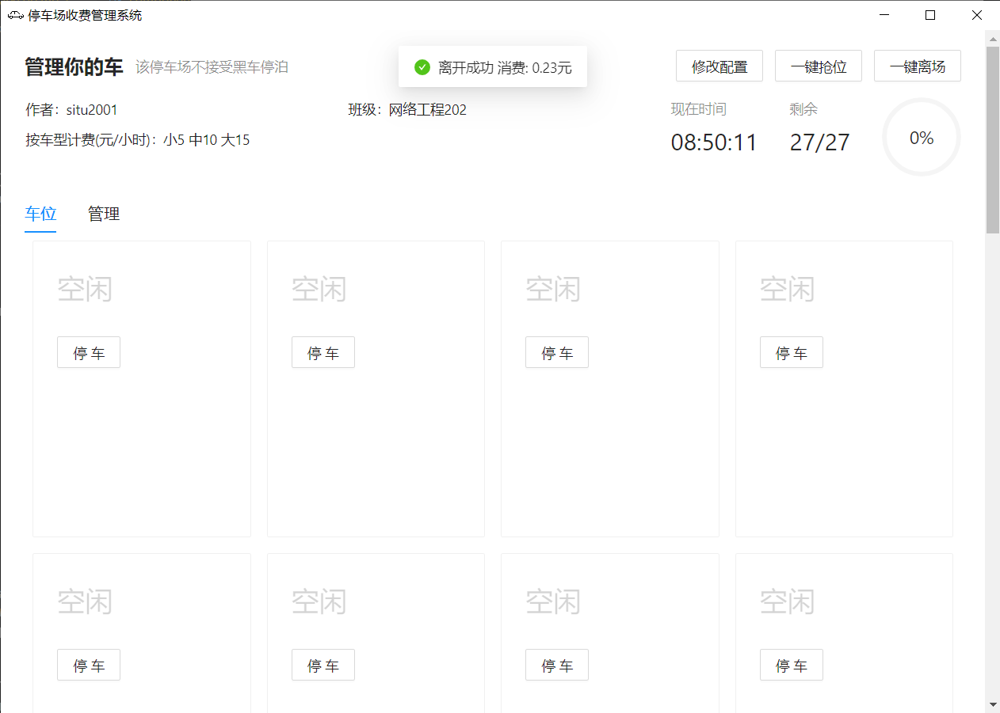

### Admin-side

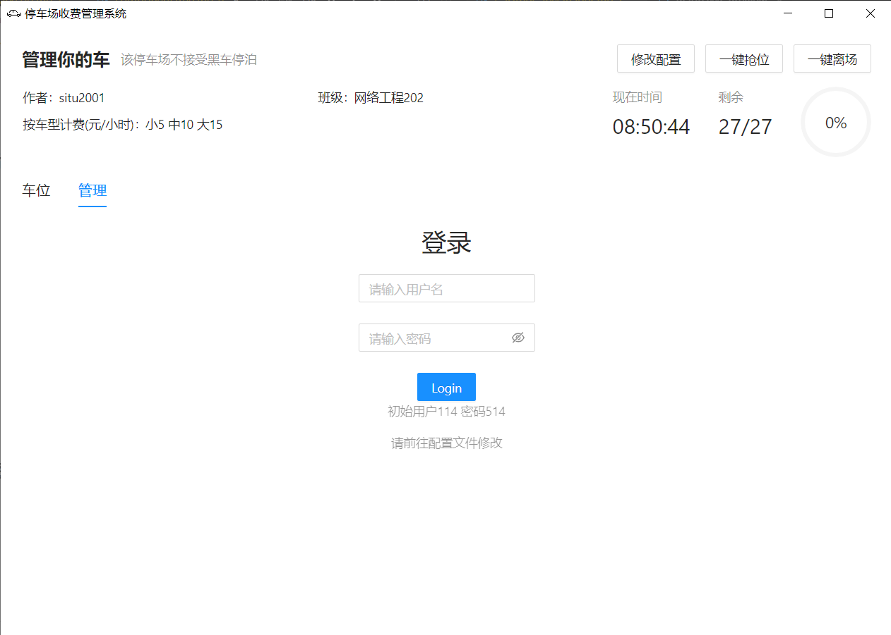

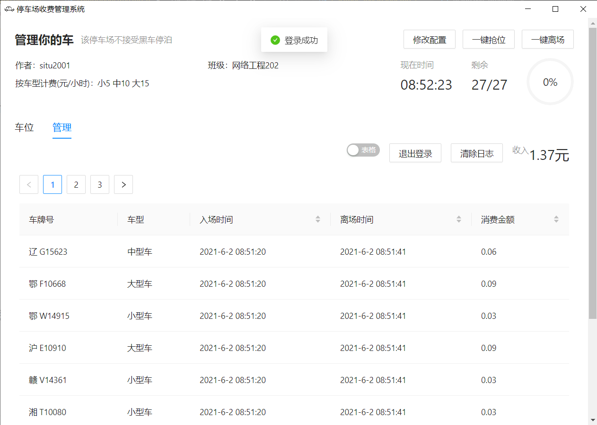

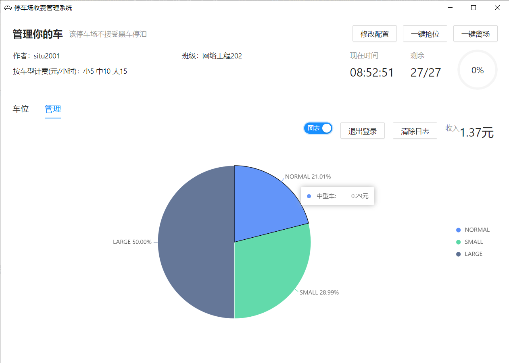

其实本文通篇没有提到布局是因为当时并不是很会布局。。。

最后得出的教训是：还是好好去学学CSS吧。。。~~在做着静态博客并顺便学习了~~

## 写在后面

因为时间紧迫，代码里头的类型出现了一坨`any` （~~还好不全是~~），这是一种对自己对他人不负责的行为。并且有一些地方写出了硬编码（比如车型）。这不是一种良好的习惯。~~不过在考试周做课设才是问题所在吧谁想这么赶~~

最后发朋友圈粗略总结本周的时候才发现月份显示出现off-by-one错误，草。。。~~看来还是赶工的锅~~

这次课设对于我来说，最大的意义，就是通过一次electron桌面软件开发，了解到了目前JS生态下的一些工具和框架，并体验了一次通过现有框架来来进行的软件开发：使用框架提供的API和配套工具，需要耐心去读官方所提供的文档，遇到了坑之后应当去Google一下或者StackOverflow查查，或者去看对应的issues。
